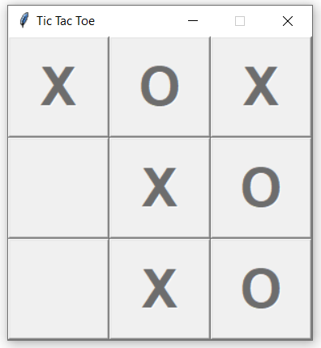
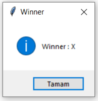

# Python TicTacToe

Tic-tac-toe game example with python tkinter.
Show some ❤️ and star the repo to support the project.


## Getting Started 
Check the sample steps to run it on your computer.

### Installing

1. Clone this repository.
2. Allow execution of the `TicTacToe-tkinter.py` file: `$ chmod a+x ./TicTacToe-tkinter.py`
3. 3. Execute `main.py`: 

    ```
    $ ./TicTacToe-tkinter.py
    ```

    or

    ```
    $ python main.py
    ```
   
### Screen Shoots



### Game over 


